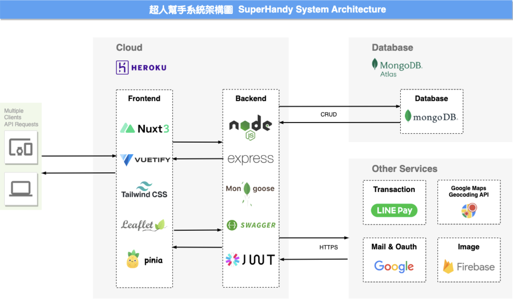
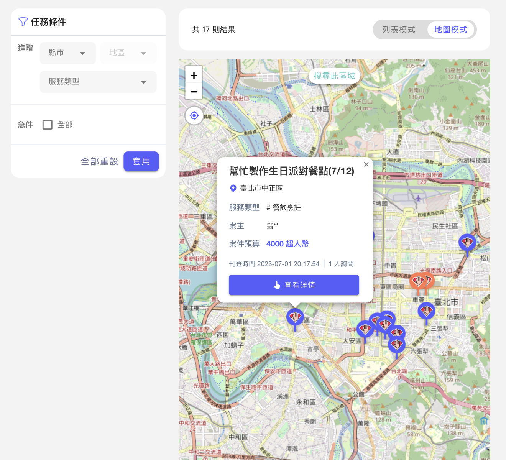
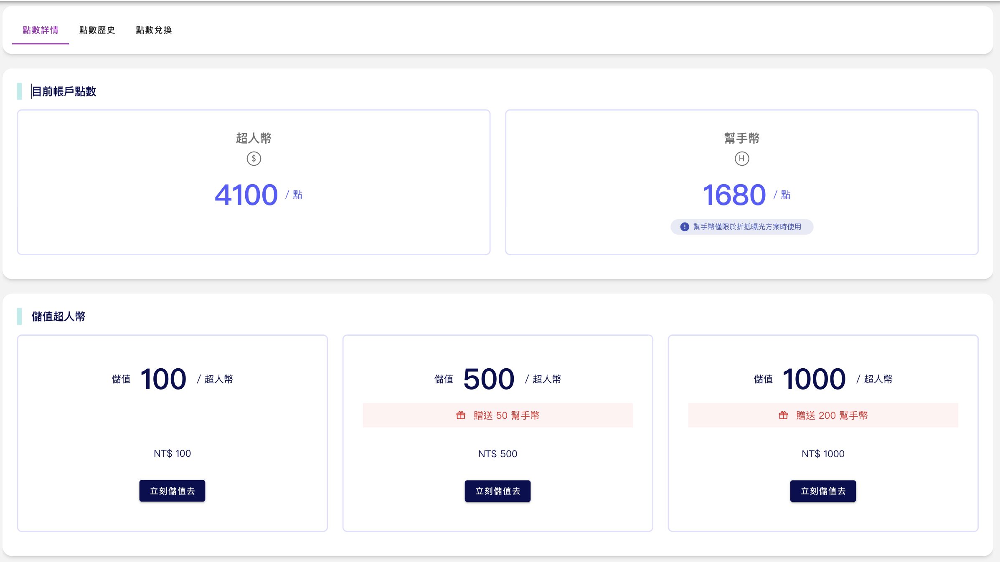
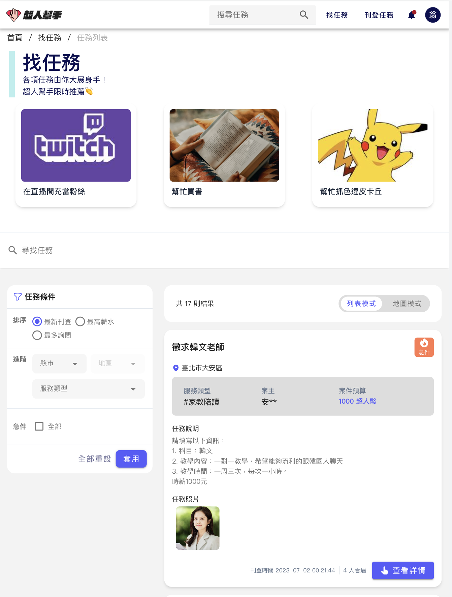
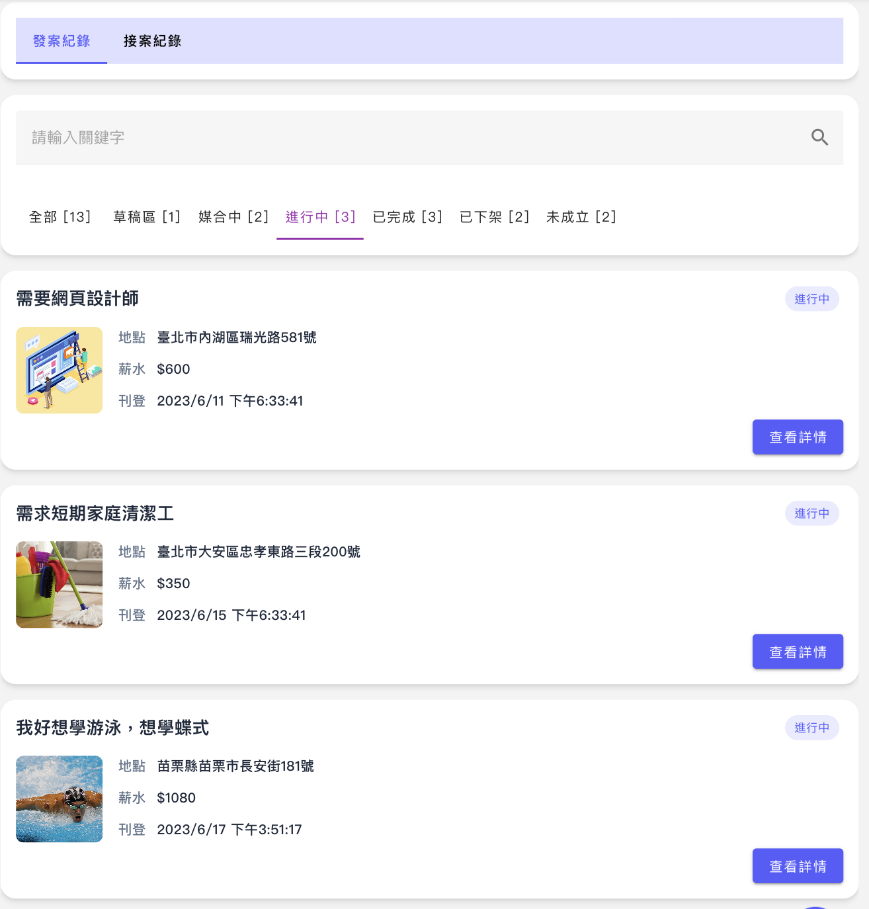
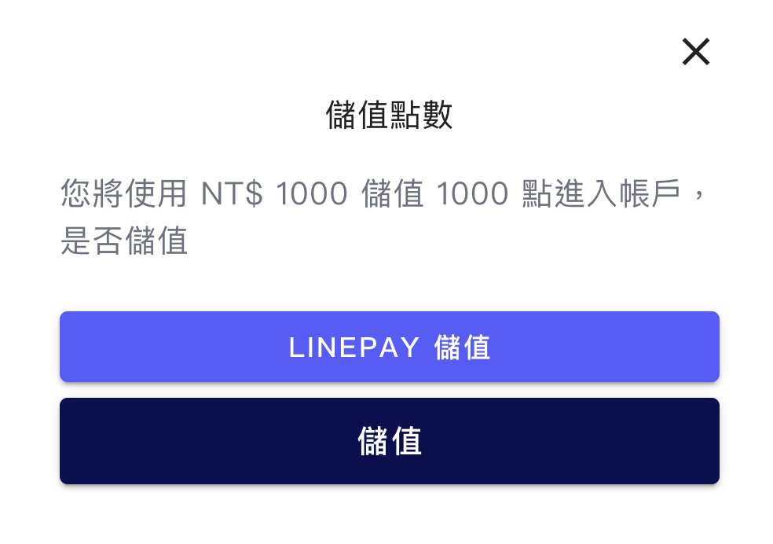
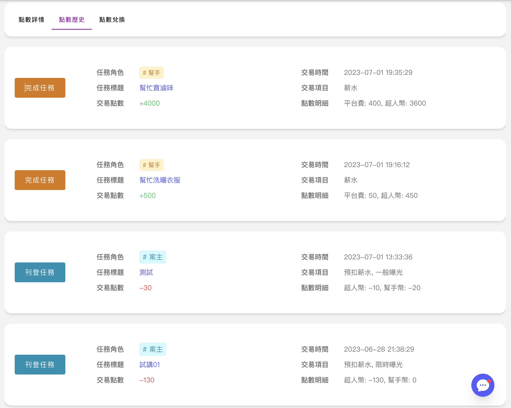

<p align="center">
  <a href="./README.md"> English </a> | <a href="./README.zh-TW.md"> 繁體中文
  </a>
</p>
  
<p align="center">
  北三組共同開發<br></a>
<br>

</p>

# SuperHandy-frontend

「讓您在生活中擁有超人的力量」。這個理念代表著我們的使命是提供一個平台，讓使用者可以輕鬆地找到需要幫助的任務。同時，我們也希望讓使用者感受到自己像超人一樣有能力去幫助別人解決問題，實現自我價值的提升。

## 預覽

[線上環境](https://superhandy-frontend-fork.herokuapp.com/)


## 系統架構圖

本專案採前後端分離，前端採用 Vue 搭配 Nuxt3 框架開發，後端採用 NodeJs 搭配 Mongo DB。

[後端程式碼連結](https://github.com/erik1110/SuperHandy-backend)



## 專案特色

1. 地圖搜尋
   

2. 聯天室
   

3. 技能評價
   

4. 會員點數加值服務
   

## Other Features

1. 找任務
   

2. 任務管理
   

3. 系統通知
   

4. 交易功能
   
   

## 快速開始

- (1) 建立 `config.env`。 (可以複製 `example.env`)
- (2) 執行 `pnpm install`。
- (3) 依照你的環境去執行下方的程式碼。

### 開發環境

```bash
pnpm run dev
```

### 正式環境

```bash
pnpm run build
```

```bash
pnpm run preview
```
